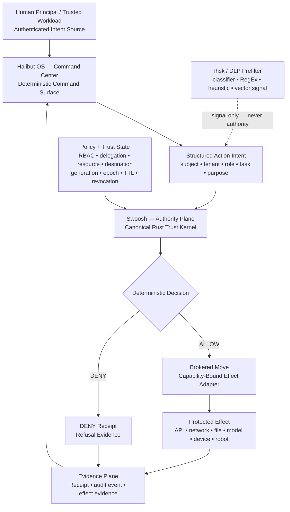
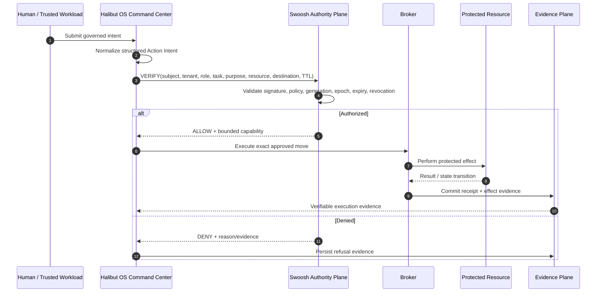

# ViTech Swoosh Core

> **Open-source developer preview — `v0.1.0-preview`**  
> Security-sensitive preview release. Not an industrial or functional-safety certification.

**Swoosh Core** is ViTech's inspectable deterministic authority layer for governed AI, agents, software, tools, devices and machines.

Its job is deliberately narrow:

> **Models may reason. Swoosh decides whether protected action is authorized.**

Swoosh is not an AI model, planner or workflow engine. It is the security boundary that determines whether a structured action may proceed.

---

## Quick start

Requirements: Rust 1.85+.

```bash
cargo test --locked --workspace --all-targets
cargo run --locked -p proof-pack --quiet
```

To verify protocol fixtures:

```bash
cd protocol
python -m venv .venv
.venv/bin/python -m pip install .
.venv/bin/python -m unittest discover -s tests -v
```

For full release-quality verification, see [Build and verify](#build-and-verify).

---

## Why Swoosh exists

Modern AI systems can reason, browse, call tools, use files, invoke APIs and control machines.

Capability is useful.

Capability is **not authority**.

Swoosh separates the two:

```text
MODEL CAPABILITY
may increase

        while

MODEL AUTHORITY
remains explicitly bounded
```

A frontier model may be more capable than a local model without automatically receiving more access.

Native browsing, tool use, connectors or model-provider features do not create permission.

---

## Canonical trust path

```text
AUTHENTICATED HUMAN / TRUSTED WORKLOAD
        ↓
STRUCTURED ACTION INTENT
        ↓
CANONICAL SWOOSH VERIFIER
        ↓
identity
tenant
role / delegation
policy
purpose
resource
destination
task generation
effect binding
policy version
trust epoch
expiry / revocation
        ↓
DETERMINISTIC
ALLOW / DENY
        ↓
BROKERED EFFECT
        ↓
EVIDENCE / RECEIPT
```

Natural language, model output, classifier scores, observability findings and risk heuristics may inform a request.

They are **not capabilities** and they are **not authorization decisions**.


---

## Swoosh technical architecture

### Authority Plane — deterministic protected-action workflow



### Swoosh runtime authorization sequence



## Official ViTech environment and plane definitions

The following terms are the canonical terminology used across the ViTech architecture. A **surface** is where an operator or subsystem interacts with the system. A **plane** is a functional architectural responsibility. An **environment** is the governed runtime context in which those planes and surfaces operate.

| Official term | ViTech definition |
|---|---|
| **Command Center** | The governed operator-facing surface of **Halibut OS** where authenticated human intent enters the system, Goal Contracts are initiated, runtime state is reviewed, and governed work can be started, paused, escalated, or terminated. It is a command surface—not the authorization engine. |
| **Control Plane** | The deterministic governance path that carries human intent through command lifecycle, role/task assignment, authority requests, execution control, intervention routing, and closure. **Halibut OS** owns the command/control lifecycle; **Swoosh** supplies deterministic authority inside that lifecycle. |
| **Authority Plane** | The deterministic security plane implemented by **Swoosh Core**. It verifies identity, tenant, role/delegation, purpose, resource, destination, task generation, policy version, trust epoch, expiry, revocation, and effect binding before a protected move may occur. |
| **Switchboard** | The runtime signal-routing and intervention surface used by **Halibut Observability Intelligence** in the broader architecture. It routes telemetry, drift, health, quality, dependency, and escalation signals back toward Halibut OS. The Switchboard may request intervention; it never creates authority. |
| **Execution Plane** | The bounded runtime environment where authorized work is scheduled and performed. In the ViTech architecture this is primarily **ViRTOS + brokered adapters + the user-owned AI/tool/robot workforce**. Execution consumes authority; it does not mint it. |
| **Intelligence Plane** | The reasoning environment containing **Halibut Intelligence** and approved user-selected models. It plans, decomposes, coordinates, verifies facts, and recommends actions. Intelligence may request authority but does not grant itself authority. |
| **Evidence Plane** | The proof/audit environment that records what was requested, authorized or denied, executed, observed, and committed. It supports receipts, effect evidence, audit chains, completion verification, and later accountability. |
| **Broker** | The deterministic adapter/gateway that converts an authorized capability into the exact protected effect. It is the enforcement point between an authorization decision and an external resource. |
| **Protected Effect** | Any state-changing or trust-boundary-crossing action: network egress, API invocation, file mutation, cloud-model call, device command, database write, robot actuation, or other governed resource operation. |
| **Trust Boundary** | The architectural boundary beyond which identity, authority, data scope, or effect scope cannot be assumed. Crossing it requires explicit verification and brokered enforcement. |
| **Prove** | The post-effect stage that produces verifiable evidence showing what was allowed or denied, what actually happened, and whether the realized effect matched the authorized intent. |

### Branding rule

The ViTech architecture uses these terms deliberately:

```text
COMMAND CENTER
    receives and governs human intent

CONTROL PLANE
    controls the lifecycle of governed work

AUTHORITY PLANE
    determines whether protected action is allowed

INTELLIGENCE PLANE
    reasons, plans, coordinates, and verifies

EXECUTION PLANE
    performs bounded work

SWITCHBOARD
    routes runtime signals and intervention intents

EVIDENCE PLANE
    proves what actually happened
```

> **No plane may silently absorb the authority of another plane.**

In particular:

- Intelligence cannot become Authority.
- Observability cannot become Authority.
- Execution cannot create Authority.
- Enterprise extensions cannot override a canonical Swoosh `DENY`.


---

## Core security invariant

```text
MODEL OUTPUT
    ↓
optional risk / DLP prefilter
    ↓
STRUCTURED ACTION INTENT
    ↓
HALIBUT OS CONTROL CHECK
    ↓
SWOOSH VERIFY
    ↓
DETERMINISTIC DECIDE
    ↓
BROKERED MOVE
    ↓
PROVE
```

Only Swoosh returns authoritative `ALLOW` or `DENY`.

### Protected resources can include

- internet destinations;
- APIs and third-party applications;
- remote data;
- files and storage;
- devices and robots;
- cloud/frontier models;
- privileged commands;
- tenant-protected context;
- production effects.

---

## What developers can verify

This repository is intended to let developers independently inspect and test the local authority path.

The community should be able to reproduce cases such as:

```text
wrong subject          → DENY
wrong tenant           → DENY
wrong role             → DENY
wrong task generation  → DENY
wrong resource         → DENY
wrong purpose          → DENY
wrong destination      → DENY
expired lease          → DENY
revoked capability     → DENY
trust rollback         → DENY
tampered action        → DENY
unauthorized effect    → DENY
```

The goal is not:

> "Trust ViTech because we said it is secure."

The goal is:

> **Do not simply trust ViTech. Verify ViTech.**

---

## Repository layout

| Path | Purpose |
|---|---|
| `trust-kernel/` | Canonical zero-I/O Rust authority engine |
| `trust-sdk/` | Thin host interface to the canonical kernel |
| `trust-console/` | Reference CLI used for native verification |
| `proof-pack/` | Reproducible adversarial and industrial-style tests |
| `protocol/` | Public schemas, fixtures and optional Python codec |
| `docs/security/` | Threat model and key-management guidance |
| `docs/decisions/` | Canonical architecture decisions |
| `scripts/` | Provenance, licensing and SBOM verification |
| `.github/workflows/` | Release-quality CI |

---

## Build and verify

### Rust authority core

Requirements:

- Rust 1.85
- Cargo

Run:

```bash
cargo fmt --all --check
cargo clippy --locked --workspace --all-targets -- -D warnings

cargo check --locked -p trust-kernel --no-default-features
cargo check --locked -p trust-kernel --target wasm32-unknown-unknown --no-default-features

cargo test --locked --workspace --all-targets

cargo run --locked -p proof-pack --quiet

python scripts/check-rust-provenance.py
python scripts/check-license-coverage.py
```

### Protocol conformance

Requirements:

- Python 3.12+

Run:

```bash
cd protocol

python -m venv .venv
.venv/bin/python -m pip install .
.venv/bin/python -m unittest discover -s tests -v
```

---

## Proof Pack

The Proof Pack exists to make security claims reproducible.

It includes tests for:

- canonical signed actions;
- pinned host context;
- generation binding;
- destination binding;
- effect binding;
- revocation and expiry;
- anti-rollback / trust epoch behavior;
- malformed or tampered requests;
- Halibut-native integration fixtures.

See:

`docs/testing/PROOF_PACK.md`

---

## Swoosh and Halibut

Swoosh is intentionally independent from the reasoning system.

```text
HUMAN / RBAC AUTHORITY
        ↓
HALIBUT OS
deterministic command plane
        ↓
SWOOSH
deterministic authority
        ↓
ViRTOS / brokered execution
        ↓
AI / agent / robot / tool
```

Halibut may decide that an action is useful.

Swoosh determines whether it is authorized.

That separation is non-negotiable.

---

## No internet-first execution

A protected worker does not receive internet, cloud-model, remote-data or third-party application access merely because its model supports those capabilities.

The expected path is:

```text
AI requests external resource
        ↓
Halibut OS
        ↓
Swoosh
        ↓
verify:
destination
purpose
data class
scope
TTL
human / RBAC authority
        ↓
ALLOW or DENY
        ↓
brokered access
        ↓
evidence
```

---

## Licensing

Swoosh Core uses **per-path licensing**.

### MPL-2.0

The local deterministic enforcement implementation is licensed under the **Mozilla Public License 2.0**.

This includes the canonical Rust trust implementation and local enforcement components.

### Apache-2.0

Public protocol assets, schemas, fixtures, documentation and interoperability interfaces are licensed under the **Apache License 2.0**.

See:

- `LICENSE`
- `LICENSES/MPL-2.0.txt`
- `LICENSES/Apache-2.0.txt`
- `REUSE.toml`

Package manifests also declare their corresponding SPDX licenses.

---

## What is intentionally not here

This repository does **not** contain ViTech's commercial organization-control implementation.

Excluded assets include:

- Organization Control Plane;
- distributed enterprise Swoosh administration;
- enterprise identity/federation management;
- fleet administration;
- production signer custody;
- enterprise Observability Intelligence;
- protected Intelligence Capsule methodologies;
- customer or institutional data;
- private hosted-service implementation.

Open-source security is not intentionally weakened to create an Enterprise upsell.

> Enterprise extensions may add scale and managed operations, but they must never convert a canonical deterministic `DENY` into `ALLOW`.

---

## Release status

Current target:

`v0.1.0-preview`

This is a developer preview, not an industrial safety certification.

Before public release we require:

- clean CI;
- Rust quality gates;
- protocol conformance;
- adversarial Proof Pack;
- dependency/license provenance;
- SPDX SBOMs;
- native Halibut ↔ Swoosh conformance;
- protected `main`;
- human technical review;
- explicit owner approval.

See `RELEASE_CHECKLIST.md`.

---

## Security review

Please read:

- `SECURITY.md`
- `docs/security/THREAT_MODEL.md`
- `docs/security/KEY_MANAGEMENT.md`

Security-sensitive changes should be reviewed by a human technical reviewer before release.

---

## Contributing

See `CONTRIBUTING.md`.

Authority-sensitive changes must preserve:

- one canonical deterministic authority kernel;
- fail-closed behavior;
- bounded parsing;
- revocation and expiry;
- anti-rollback semantics;
- model/provider neutrality;
- brokered protected effects;
- separation of reasoning from authority.

---

## ViTech principle

> **Model capability may increase without increasing model authority.**

That is the purpose of Swoosh.
