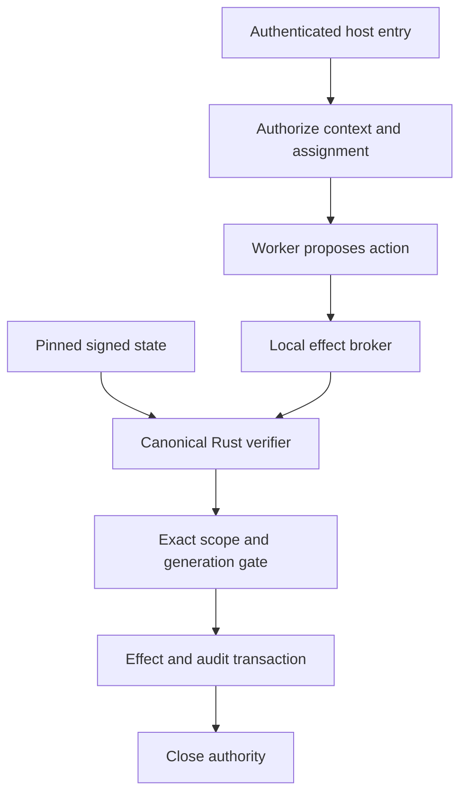

# Authority and interoperability architecture

The Rust kernel is the single decision implementation. Host identity, time, storage, transport and installed-state custody remain outside it. The SDK passes trusted host inputs to that kernel; the protocol codec validates shape only.



All tool/device adapters must be reached through the broker. Routing chooses an eligible backend; it cannot execute a protected action or supply credentials directly. Renewal, revocation, expiry, current-state changes and cancellation are checked before each effect. The local profile supports one transactional record adapter; general remote effect protocols and hostile worker isolation remain release gates.

See [contracts/v1](../contracts/v1/README.md) for the eight foundational contracts plus the packet envelope. They do not contain protected Capsule method content. Runtime state and the signed claim remain authoritative, rather than any `allowed` field in JSON.

The native v2 envelope is additive. V1 signed bytes, receipts and TrustPack format are preserved. Native conformance tests and no-std/Wasm compile checks live with the Rust source; portable JSON conformance tests live here. Runtime-specific interoperability must pass canonical vectors before being advertised as supported.

## Deterministic authorization boundary

Classifiers, RegEx, vector guardrails, DLP systems, model output and observability intelligence may emit risk or intervention signals. They do not grant authority.

```text
MODEL / OBSERVABILITY SIGNAL
       ↓
STRUCTURED ACTION OR CAPABILITY REQUEST
       ↓
HALIBUT OS CONTROL CHECK
       ↓
SWOOSH VERIFY
       ↓
DETERMINISTIC DECIDE
       ↓
BROKERED MOVE
       ↓
PROVE
```

Authorization depends on authoritative identity, tenant, RBAC, policy, purpose, resource, lease, approval and revocation state. Internet and remote-model access are treated exactly like any protected resource: destination, purpose, permitted data class and TTL must be explicit. Unrestricted egress is not the default.
