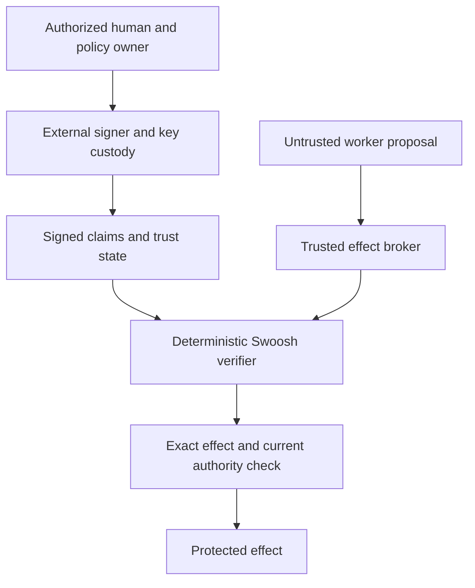

# SWOOSH Canonical Trust Kernel Threat Model

**Scope:** Rust `trust-kernel`, Rust `trust-sdk`, `trust-console` local TrustPack management and `proof-pack`.

**Status:** BUILT — HARDENING REQUIRED

## Assets

- authoritative issuer public-key bindings;
- TrustPack signing authority and pinned bootstrap checkpoint;
- monotonic Trust Epoch/root/status/policy versions;
- claim authenticity, revocation and freshness decisions;
- privacy-minimized decision receipts;
- last-known-good local TrustPack.

Private signing keys are explicitly outside this repository and verifier runtime.

## Enforcement path and root of trust

The kernel is a decision component. Its `ALLOW` is enforceable only when a trusted broker mediates every protected effect and workers cannot reach those effects directly. The host authenticates the real caller, chooses trusted time/state, supplies the exact effect binding and performs the final scope/generation/expiry check. A caller-supplied role label is not authentication.

The signer is also part of the trusted deployment: signature verification does not establish that the signer correctly implemented human intent. Production signers must authenticate an authorized human or policy owner, bind the immutable approved objective/scope and never sign authority exceeding that ceiling. Signed Goal Contracts and delegation-attenuation enforcement are target integrations; the current kernel does not implement a Goal Contract issuer.

Worker isolation surrounds this path and must prevent alternate access to the protected effect. It is a deployment requirement, not implemented by this diagram or by the zero-I/O kernel. Future integrations must demonstrate denied direct network/API/device/database access, including inherited credentials and file descriptors. Regex guards and model risk scores cannot substitute for that test.

Identity roots, authenticated checkpoint distribution, protected signer keys, trusted clock policy and an independently retained rollback floor define the root of trust. Rolling back the whole host disk/VM together with its local state is outside the current software-only rollback protection. Snapshot-resistant epoch/revocation custody needs an external trusted store or hardware-backed monotonic state.

The kernel does not implement data-flow, egress-volume or rate budgets. Individually allowed operations can still compose into data exfiltration. Brokers and signers must enforce workload-specific destinations, permitted data classes and budgets before exposing remote adapters.

Physical job authorization must stay outside certified machine-safety control loops. Pause/revocation requires a device-specific safe-stop handshake handled by the native safety controller; a verifier denial alone does not stop motion.

## Trust boundaries

| Boundary | Trusted input | Untrusted input | Control |
|---|---|---|---|
| Claim wire | none | all raw claim bytes | size bound, total deserialization, schema checks, strict Ed25519 verification |
| TrustPack wire | pinned/current root only | candidate bytes and transport | size bound, canonical signature, validity, epoch/root/status/policy anti-rollback |
| Host clock | deployment clock strategy | device wall-clock manipulation | explicit injected Unix time, narrow skew, bounded pack lifetime; stronger deployments require secure/monotonic clock controls |
| Local store | last atomically installed pack | disk corruption, replacement or concurrent writers | bootstrap pin, update chain verification, OS advisory lock across read/verify/replace, temporary-file fsync and atomic rename |
| SDK/kernel | kernel result | SDK caller buffers | borrowed pass-through; no duplicate trust semantics |
| Receipt/logging | minimal metadata | operator retention/export | no subject commitment, capability evidence or raw claim in receipt |

## Threats and implemented mitigations

| Threat | Result | Mitigation |
|---|---|---|
| Modified claim payload or signature | invalid signature | domain-separated canonical bytes and `verify_strict` |
| Unknown/forged issuer | unknown issuer/key | direct lookup in isolated `TrustAnchorRoot` |
| Algorithm/key-purpose confusion | denied | only Ed25519 v1; claim and TrustPack key purposes are distinct |
| Claim revocation | denied before expiry/freshness | issuer-scoped domain-separated revocation digest, sorted embedded manifest and binary lookup |
| Expired or stale claim | denied | explicit host time, expiry and maximum-age checks |
| Cross-domain claim | denied | claim, root, anchor and pack domain bindings |
| Policy confusion | denied | exact issuer/capability/action/resource match and minimum assurance |
| Replayed old TrustPack | rejected | strictly increasing Trust Epoch and local current-pack transition |
| Root rollback/jump | rejected | no decrement; no advancement by more than one generation |
| Status/policy rollback | rejected | monotonic manifest/policy versions and append-only revocation membership |
| Arbitrary TrustPack bootstrap | rejected | out-of-band pinned checkpoint required |
| Offline beyond authority boundary | refresh failure | signed pack `valid_until` and maximum offline age |
| Parser memory abuse | bounded failure | 4 KiB claim and 1 MiB TrustPack wire limits plus collection caps |
| Partial or concurrent local update | last state preserved | OS advisory lock spans read/verify/replace; validate first; same-directory temporary file, fsync, atomic persistence; stale lock files are inert |
| PII replication through receipt | minimized | fingerprints and governance metadata only |

## Residual risks and deployment obligations

- A manipulated host clock can extend or shorten perceived validity. High-assurance deployments must bind wall time to secure/monotonic elapsed-time evidence.
- A compromised issuer or TrustPack private key can produce valid malicious objects until emergency rotation/revocation reaches verifiers.
- A fully compromised verifier host can bypass the application around the kernel, suppress updates or alter displayed results.
- Checkpoint distribution must be authenticated out of band; copying a checkpoint from the same untrusted channel as the first pack defeats bootstrap custody.
- Denial of service remains possible through repeated invalid inputs even though individual inputs are bounded.
- The current status manifest is a full sorted list; population privacy and large-scale encoding require measured review before production scale.
- Receipts are deterministically hashed but are not signed by the kernel. Deployment receipt signing/append-only storage belongs outside the zero-I/O decision path.
- Independent cryptographic/security review and representative device testing remain required before high-impact use.

## Adversarial verification

The Proof Pack covers:

- forged/tampered signature;
- unknown issuer;
- cross-domain input;
- revocation;
- expiry;
- stale claim;
- default-deny policy mismatch;
- oversized and arbitrary parser input;
- epoch rollback;
- offline boundary;
- state purge/recovery from a pinned checkpoint;
- key rotation with graceful old-claim acceptance and rejection of new old-key issuance.

## Incident priorities

1. Freeze publication and identify affected trust domains.
2. Publish a higher-epoch emergency TrustPack signed by an unaffected authorized pack key.
3. Revoke/deprecate compromised keys and shorten offline validity as risk requires.
4. Require refresh when trustworthy current state cannot be established.
5. Preserve the last validated pack and audit evidence; never reinstall a lower epoch as an informal fix.
6. Rotate private material in the external KMS/HSM and distribute a newly pinned checkpoint when the pack-signing root itself cannot authorize recovery.
